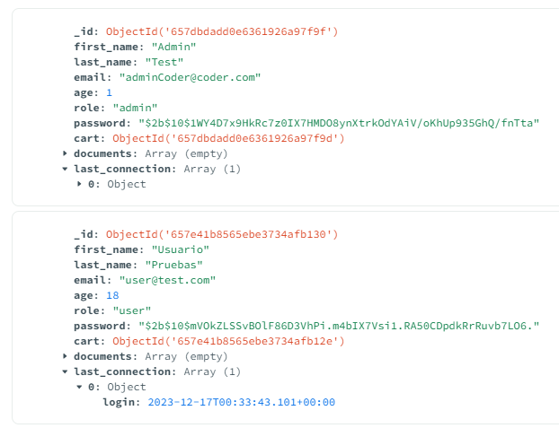
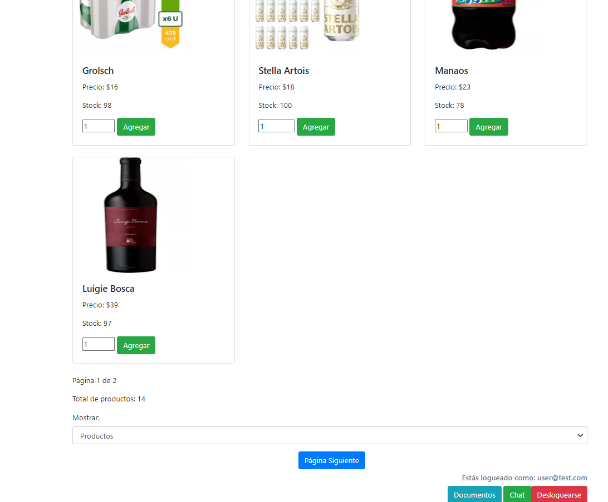
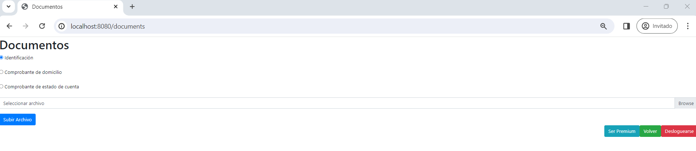

## :hammer:Entrega final de BackEnd!!!

* http://localhost:8080/ 

* Usuario de pruebas

user: user@test.com
password: 1

ADMIN
user: adminCoder@coder.com 
password: 1

* La últma conexión del usuario que se actualiza con LOGIN o LOGOUT.

* Desde la vista de productos el usuario tiene disponible el botón "Documentos" que le permite subir los documentos necesarios para luego habilitar ser Premium.

* Una vez en la vista "Documentos" con el radio button elijo una opción de tipo de documento que voy a subir para luego asi subirlo.

* Si aún no he subido ningún documento, ni cree una carpeta, gracias a Multer se creara sola la carpeta destinada a documentos. Tambien esta preparada la app, para crear otras carpetas para productos o fotos de perfil en caso de que sea necesario.

* Tengo notificación de correcta subida del documento.

* Una vez que subi el documento se ve como se creo sola la carpeta para estos.

* Mongo se actualiza correctamente con el documento subido.

* Desde la vista "Documentos" siempre tengo disponible el botón "SER PREMIUM" pero en caso de no cumplir la condición de subir por lo menos un documento de cada uno de los tres disponibles, me dará error al apretarlo y no permitirá el Upgrade.

* Si cumplo con las condiciones previamente mencionadas, tendré la notificación del correcto Upgrade de role.

* Mongo actualizo OK el rol de "user" a "premium"

* Nuevo acceso premium disponible

* Permisos premium

